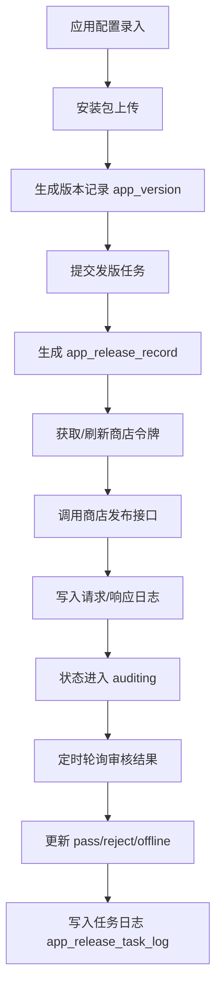

# 整体功能调用链路

## 1. 文档目的

本文档用于梳理当前 `app-publish-service` 的整体功能调用链路，覆盖：

- 应用基础信息与商店配置维护
- 安装包上传与版本入库
- 发版提审
- CI/CD 一键上传并提审
- 审核结果轮询与状态回写
- 令牌缓存、商店接口适配、日志落库

重点不是接口字段说明，而是“一个请求进入系统后，内部经过哪些类、哪些表、哪些状态变化”。

---

## 2. 总体分层

### 2.1 控制层

- `AppController`
  - `POST /api/apps`
  - `GET /api/apps/{appId}`
- `PackageController`
  - `POST /api/apps/{appId}/versions/upload`
- `ReleaseController`
  - `POST /api/releases/submit`
  - `GET /api/releases/{releaseId}`
- `CicdController`
  - `POST /api/cicd/releases/trigger`

### 2.2 服务层

- `AppManagementService`
  - 应用信息和商店配置的保存、查询
- `PackageVersionService`
  - 安装包上传、解析、校验、版本入库
- `PackageInspectorService`
  - 安装包元数据识别
- `StorageService`
  - 安装包落盘路径分配
- `ReleaseOrchestrationService`
  - 发版主编排、审核轮询
- `CicdReleaseService`
  - CI/CD 触发“上传 + 提审”组合流程
- `TokenService`
  - 商店令牌获取与缓存
- `ConfigurableStorePublisher`
  - 商店接口适配层
- `ReleaseLogService`
  - 发版任务日志落库

### 2.3 定时任务

- `ReleaseReviewPollingJob`
  - 固定周期触发审核状态轮询

### 2.4 持久化层

主要表：

- `app_info`
- `app_store_config`
- `app_version`
- `app_release_record`
- `app_api_token_cache`
- `app_release_task_log`

---

## 3. 核心对象关系

### 3.1 应用配置关系

1. `app_info`
   - 一条记录表示一个应用
2. `app_store_config`
   - 通过 `app_id` 关联应用
   - 一条记录表示该应用在某个商店的一套 API 配置

### 3.2 版本关系

1. `app_version`
   - 通过 `app_id` 关联应用
   - 一条记录表示一个上传成功的安装包版本

### 3.3 发版关系

1. `app_release_record`
   - 通过 `app_id` 关联应用
   - 通过 `version_id` 关联版本
   - 一条记录表示“某个版本投递到某个商店”的一次发版任务
2. `app_release_task_log`
   - 通过 `release_record_id` 关联发版记录
   - 一条记录表示发版过程中的一次状态动作日志

### 3.4 令牌关系

1. `app_api_token_cache`
   - 通过 `store_config_id` 关联商店配置
   - 用于缓存 access token / static token

---

## 4. 系统主链路总览



---

## 5. 调用链路详解

## 5.1 链路一：应用基础信息与商店配置维护

### 入口

- `POST /api/apps`

### 调用链

1. `AppController.save`
2. `AppManagementService.saveApp`
3. `AppInfoRepository`
4. `AppStoreConfigRepository`

### 处理过程

1. 控制器接收 `AppUpsertRequest`
2. `AppManagementService` 判断是新增还是更新：
   - `request.id == null`：新建 `AppInfo`
   - 否则：先 `requireApp` 查出已有应用再更新
3. 将请求中的应用基础字段写入 `app_info`
4. 查询该应用当前已有的 `app_store_config`
5. 遍历 `storeConfigs`
   - 根据 `storeType` 找已有配置
   - 没有则新建 `AppStoreConfig`
   - 写入 `clientId/clientSecret/token/...`
6. 返回 `AppResponse`

### 涉及表

- `app_info`
- `app_store_config`

### 输出结果

- 应用基础信息持久化
- 多商店 API 配置持久化

---

## 5.2 链路二：安装包上传与版本入库

### 入口

- `POST /api/apps/{appId}/versions/upload`

### 调用链

1. `PackageController.upload`
2. `PackageVersionService.upload`
3. `AppManagementService.requireApp`
4. `StorageService.allocatePath`
5. `PackageInspectorService.inspect`
6. `AppVersionRepository.insert`

### 处理过程

1. 根据 `appId` 查询应用，不存在则抛 `NotFoundException`
2. `StorageService` 按以下规则分配落盘路径：
   - 根目录来自 `app.storage-root`
   - 子目录按当天日期 `yyyyMMdd`
   - 文件名为 `UUID + 原始扩展名`
3. `MultipartFile.transferTo(target)` 将文件保存到本地
4. `PackageInspectorService.inspect` 识别安装包元数据：
   - 优先读取压缩包内 `app-publish-metadata.json`
   - 其次从文件名推断 `versionName/versionCode`
   - 同时识别 `reinforced` 状态
   - 生成文件 `SHA-256`
5. `PackageVersionService` 执行业务校验：
   - iOS 应用只能传 `ipa`
   - Android 应用不能传 `ipa`
   - 如果传了 `expectedVersionName/Code/Reinforced`，必须一致
   - 不能与已有版本重复
   - `versionCode` 必须大于当前最新版本
6. 组装 `AppVersion` 并写入 `app_version`
7. 返回 `PackageUploadResponse`

### 涉及表

- `app_info`
- `app_version`

### 外部资源

- 本地文件系统 `storage-root/yyyyMMdd/uuid.ext`

### 输出结果

- 安装包文件已落盘
- 一个可用于后续发版的版本记录已创建

---

## 5.3 链路三：提交发版任务

### 入口

- `POST /api/releases/submit`

### 调用链

1. `ReleaseController.submit`
2. `ReleaseOrchestrationService.submit`
3. `PackageVersionService.requireVersion`
4. `AppManagementService.requireStoreConfig`
5. `AppReleaseRecordRepository.insert`
6. `ReleaseLogService.log`
7. `TokenService.getValidToken`
8. `StorePublisher.submitRelease`
9. `AppReleaseRecordRepository.updateById`
10. `ReleaseLogService.log`

### 处理过程

1. 根据 `versionId` 查询 `app_version`
2. 遍历 `storeTypes`
3. 对每个商店：
   - 解析成 `StoreType`
   - 查出该应用对应的 `app_store_config`
   - 检查 `apiStatus == 1`
4. 先创建一条发版记录 `app_release_record`
   - 初始状态：`API_PENDING`
5. 写一条任务日志：
   - `CREATE_RELEASE`
6. 通过 `TokenService` 获取有效令牌
   - 优先查 `app_api_token_cache`
   - 缓存过期或不存在时，通过 `StorePublisher.refreshToken` 刷新
   - 写回 `app_api_token_cache`
7. 调用 `StorePublisher.submitRelease`
   - 实际实现类是 `ConfigurableStorePublisher`
8. 如果调用成功：
   - 写入 `storeReleaseId`
   - 写入 `apiRequestLog`
   - 写入 `apiResponseLog`
   - 更新状态为 `AUDITING`
   - 记录 `releaseTime`
   - 写日志 `SUBMIT_REVIEW`
9. 如果调用失败：
   - 更新状态为 `REJECT`
   - 写入 `rejectReason`
   - 写入 `apiResponseLog`
   - 记录 `finishTime`
   - 写日志 `SUBMIT_FAILED`
10. 返回每个商店对应的 `ReleaseRecordResponse`

### 涉及表

- `app_version`
- `app_store_config`
- `app_release_record`
- `app_api_token_cache`
- `app_release_task_log`

### 输出结果

- 每个商店生成一条发版记录
- 成功则进入审核中
- 失败则直接进入驳回态

---

## 5.4 链路四：CI/CD 一键上传并提审

### 入口

- `POST /api/cicd/releases/trigger`

### 调用链

1. `CicdController.trigger`
2. `CicdReleaseService.trigger`
3. `PackageVersionService.upload`
4. `ReleaseOrchestrationService.submit`

### 处理过程

1. 解析 `storeTypes` 字符串为列表
2. 先调用安装包上传链路
   - 生成 `app_version`
3. 再组装 `ReleaseSubmitRequest`
   - `versionId = upload.versionId`
   - `releaseMode = "api"`
4. 调用发版提审链路

### 特点

- 这是“上传 + 提审”的组合入口
- 适合 Jenkins / GitLab CI / GitHub Actions 之类的流水线调用

### 输出结果

- 一次请求完成：
  - 包上传
  - 版本入库
  - 多商店提审

---

## 5.5 链路五：审核状态轮询与状态回写

### 入口

- `ReleaseReviewPollingJob.poll`
- 调度表达式：`fixedDelay = app.review-poll-delay-ms`

### 调用链

1. `ReleaseReviewPollingJob.poll`
2. `ReleaseOrchestrationService.pollAuditResults`
3. `AppReleaseRecordRepository.selectList`
4. `AppManagementService.requireStoreConfig`
5. `TokenService.getValidToken`
6. `StorePublisher.queryReview`
7. `AppReleaseRecordRepository.updateById`
8. `ReleaseLogService.log`

### 处理过程

1. 查询所有状态为 `AUDITING` 的发版记录
2. 对每条记录：
   - 查出对应商店配置
   - 获取有效令牌
   - 调用商店审核查询接口
3. `StorePublisher.queryReview` 返回：
   - 新状态 `releaseStatus`
   - 响应日志 `responseLog`
   - 驳回原因 `rejectReason`
4. 如果状态发生变化：
   - 更新 `app_release_record.releaseStatus`
   - 更新 `rejectReason`
   - 如果状态已结束，写入 `finishTime`
   - 记录日志 `POLL_REVIEW`
5. 如果状态未变化：
   - 仍然更新响应日志
   - 记录“状态未变化”的 `POLL_REVIEW` 日志

### 可能状态

- `AUDITING`
- `PASS`
- `REJECT`
- `OFFLINE`

### 输出结果

- 审核状态持续同步到本地数据库
- 发版日志可追踪每次轮询结果

---

## 6. 商店适配层调用链

## 6.1 统一入口

接口：

- `StorePublisher.refreshToken`
- `StorePublisher.submitRelease`
- `StorePublisher.queryReview`

实现：

- `ConfigurableStorePublisher`

---

## 6.2 默认商店适配逻辑

适用：

- 华为 / 小米 / OPPO / 应用宝 / iOS / Google 等当前未单独定制的商店

调用方式：

1. 根据 `app.store-api.stores.<store>` 读取配置
2. 若 `mock-enabled=true` 或关键 endpoint 未配置：
   - 走本地 mock
3. 否则：
   - `refreshToken` 走 JSON POST 获取 token
   - `submitRelease` 走 JSON POST 提审
   - `queryReview` 走 GET 查询状态

状态映射：

- `pass/approved/online` -> `PASS`
- `reject/rejected/failed` -> `REJECT`
- `offline` -> `OFFLINE`
- 其它 -> `AUDITING`

---

## 6.3 Vivo 专用上传链路

由于 vivo 文档要求“上传 APK 文件 + HMAC 签名”，因此当前是单独分支处理。

### 触发点

- `ConfigurableStorePublisher.submitRelease`
  - 当 `storeType == VIVO` 时走 `submitVivoRelease`

### 调用链

1. `requireLocalPackage`
2. `md5Hex`
3. `buildVivoPayload`
4. `signVivoPayload`
5. 构造 `multipart/form-data`
6. 调用 `https://developer-api.vivo.com.cn/router/rest`
7. 解析返回 `serialnumber`

### 关键规则

1. 只允许上传 `.apk`
2. 使用 `clientId/clientSecret` 映射为：
   - `access_key`
   - `access_secret`
3. 请求体包含：
   - `access_key`
   - `timestamp`
   - `method=app.upload.apk.app`
   - `v=1.0`
   - `sign_method=hmac`
   - `format=json`
   - `target_app_key=developer`
   - `packageName`
   - `fileMd5`
   - `sign`
   - `file`
4. 签名规则：
   - 除 `file` 外，其余字段按 ASCII 排序
   - 按 `key=value&...` 拼接
   - 使用 `HmacSHA256(access_secret)` 计算
5. 成功后取 `data.serialnumber` 作为 `storeReleaseId`

### 输出结果

- vivo 商店侧流水号写入 `app_release_record.store_release_id`

---

## 7. 状态与日志流转

## 7.1 发版状态主路径

```text
API_PENDING
  -> AUDITING   （提审成功）
  -> REJECT     （提审失败）

AUDITING
  -> PASS       （审核通过）
  -> REJECT     （审核驳回）
  -> OFFLINE    （下架/离线）
```

## 7.2 任务日志动作

当前主要动作：

- `CREATE_RELEASE`
- `SUBMIT_REVIEW`
- `SUBMIT_FAILED`
- `POLL_REVIEW`

## 7.3 日志写入时机

1. 创建发版记录后立即写 `CREATE_RELEASE`
2. 提审成功后写 `SUBMIT_REVIEW`
3. 提审异常后写 `SUBMIT_FAILED`
4. 每次轮询都写 `POLL_REVIEW`

---

## 8. 异常出口

### 8.1 常见业务异常

- `App not found`
- `Version not found`
- `Store config not found`
- `Store config is disabled`
- `Version already exists`
- `Version code must increase`
- `Version name/version code/reinforced mismatch`
- `Only APK, AAB and IPA are supported`
- `Vivo upload only supports APK packages`

### 8.2 异常处理方式

1. 控制层异常最终进入 `GlobalExceptionHandler`
2. 上传链路、发版链路中的业务异常会直接返回失败响应
3. 发版循环中的异常不会中断整批提审：
   - 当前商店失败时，该商店记录记为 `REJECT`
   - 其余商店继续执行

---

## 9. 配置驱动点

### 9.1 本地存储

- `app.storage-root`

影响：

- 安装包最终落盘位置

### 9.2 令牌刷新提前量

- `app.token-refresh-ahead-seconds`

影响：

- 距离 token 过期还有多久时认为需要刷新

### 9.3 审核轮询间隔

- `app.review-poll-delay-ms`

影响：

- 定时任务轮询频率

### 9.4 mock / 真实接口切换

- `app.store-api.stores.<store>.mock-enabled`
- `baseUrl`
- `tokenEndpoint`
- `submitEndpoint`
- `statusEndpoint`

影响：

- 商店接口是走本地模拟还是走真实 HTTP 对接

---

## 10. 一次完整发布的最短闭环

### 10.1 手工链路

1. `POST /api/apps`
2. `POST /api/apps/{appId}/versions/upload`
3. `POST /api/releases/submit`
4. 定时任务 `ReleaseReviewPollingJob.poll`
5. `GET /api/releases/{releaseId}` 查看最终状态

### 10.2 CI/CD 链路

1. `POST /api/cicd/releases/trigger`
2. 定时任务 `ReleaseReviewPollingJob.poll`
3. `GET /api/releases/{releaseId}` 查看最终状态

---

## 11. 维护建议

### 11.1 新增商店时

建议优先判断该商店是否可以复用 `ConfigurableStorePublisher` 的通用 HTTP 适配。

若不行，再按 vivo 的方式加独立分支，重点补齐：

- 认证方式
- 提审参数结构
- 文件上传方式
- 审核状态映射
- 失败码解析

### 11.2 排查发布问题时

建议按以下顺序定位：

1. 看 `app_release_record.release_status`
2. 看 `app_release_record.api_request_log`
3. 看 `app_release_record.api_response_log`
4. 看 `app_release_task_log`
5. 看 `app_api_token_cache` 是否过期
6. 看本地 `package_url` 指向的安装包是否存在

---

## 12. 总结

当前系统的主干设计是：

1. `AppManagementService` 管配置
2. `PackageVersionService` 管上传和版本
3. `ReleaseOrchestrationService` 管提审和轮询
4. `TokenService + StorePublisher` 管商店对接
5. `ReleaseLogService` 管过程留痕

因此，整体调用链路本质上可以归纳为：

`配置录入 -> 包上传落盘 -> 版本入库 -> 发版记录创建 -> 获取令牌 -> 调商店接口 -> 写回状态 -> 定时轮询 -> 最终审核结果落库`
