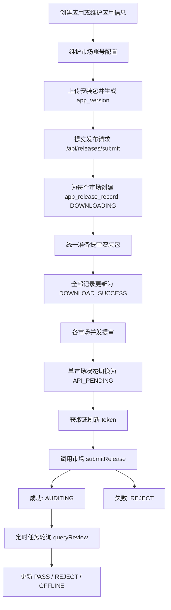

# 整体功能调用链路

## 1. 文档目的

本文档基于当前项目代码，说明 `app-publish-service` 的整体功能调用链路，重点回答以下问题：

- 应用、商店账号、安装包、发布记录分别由哪些接口和服务维护
- 一次“上传安装包 -> 提交各市场审核 -> 轮询审核结果”的完整链路如何流转
- 当前系统的并发提审、token 缓存、第三方请求日志、状态回写分别落在哪一层
- 出现发布失败、下载失败、审核状态异常时，应该优先排查哪些对象和表

说明：

- 本文档描述的是当前项目实现，不是第三方应用市场官方文档的逐字翻译
- 如与历史文档不一致，以当前代码实现为准

---

## 2. 总体分层

### 2.1 控制层

对外入口主要在以下控制器：

- `AppController`
  - `POST /api/apps`
  - `PUT /api/apps/{appId}`
  - `GET /api/apps`
  - `GET /api/apps/{appId}`
  - `DELETE /api/apps/{appId}`
- `StoreConfigController`
  - `POST /api/store-configs`
  - `PUT /api/store-configs/{configId}`
  - `GET /api/store-configs`
  - `GET /api/store-configs/{configId}`
  - `PUT /api/store-configs/{configId}/status`
  - `DELETE /api/store-configs/{configId}`
- `PackageController`
  - `GET /api/apps/{appId}/versions`
  - `GET /api/apps/{appId}/versions/{versionId}`
  - `POST /api/apps/{appId}/versions/upload`
- `ReleaseController`
  - `POST /api/releases/submit`
  - `GET /api/releases`
  - `GET /api/releases/{releaseId}`
  - `GET /api/releases/appId/{appId}`
- `CicdController`
  - `POST /api/cicd/releases/trigger`

### 2.2 业务服务层

- `AppManagementService`
  - 负责应用信息、商店账号配置、应用详情聚合、应用删除级联清理
- `PackageVersionService`
  - 负责安装包上传、版本去重、提交前安装包准备、版本查询
- `PackageInspectorService`
  - 负责安装包元数据识别，并在上传时将文件落盘
- `StorageService`
  - 负责本地存储路径分配
- `ReleaseOrchestrationService`
  - 负责发布提审主编排、状态流转、审核轮询
- `CicdReleaseService`
  - 负责 CI/CD 一键“上传 + 提审”
- `TokenService`
  - 负责第三方 token 获取与缓存
- `ConfigurableStorePublisher`
  - 负责将统一发布动作分发到各应用市场发布器
- `StoreRequestLogService`
  - 负责第三方请求日志落库

### 2.3 市场适配层

当前已注册的市场发布器如下：

- `VivoStorePlatformPublisher`
- `OppoStorePlatformPublisher`
- `HuaweiStorePlatformPublisher`
- `RongyaoStorePlatformPublisher`
- `XiaomiStorePlatformPublisher`
- `SanxingStorePlatformPublisher`
- `YingyongbaoStorePlatformPublisher`

`ConfigurableStorePublisher` 统一暴露以下能力：

- `refreshToken`
- `submitRelease`
- `queryReview`

### 2.4 定时任务与基础设施

- `ReleaseReviewPollingJob`
  - 按 `app.review-poll-delay-ms` 固定延迟轮询审核结果
- `ReleaseSubmitExecutorConfig`
  - 注册 `releaseSubmitExecutor`，用于各商店并发提审
- `JwtAuthenticationFilter`
  - 当 `app.jwt-auth.enabled=true` 时拦截业务接口，支持从请求头或 Cookie 读取 token

---

## 3. 核心对象与主要表

### 3.1 应用与账号

- `app_info`
  - 应用主表
- `app_store_config`
  - 应用市场账号配置
  - 当前接口入口为 `/api/store-configs`
  - `appId` 字段会被部分市场复用，例如应用宝 `appId`、三星 `contentId`

### 3.2 版本与发布

- `app_version`
  - 上传安装包后生成的版本记录
- `app_release_record`
  - 每个“版本 + 市场”会生成一条发布记录
  - 聚合保存 `apiRequestLog`、`apiResponseLog`、`storeReleaseId`、`rejectReason`

### 3.3 token 与三方请求日志

- `app_api_token_cache`
  - 按 `storeConfigId + tokenType` 维度缓存 token
- `app_store_request_log`
  - 第三方接口逐次请求日志表
  - 由 `StoreRequestLogService` 结合 `StoreRequestLogContextHolder` 写入

说明：

- 当前发布主链路中不再使用历史文档中的 `ReleaseLogService`
- 当前请求级日志表也不是 `app_release_task_log`，而是 `app_store_request_log`

---

## 4. 总体主链路概览



---

## 5. 详细调用链路

## 5.1 链路一：应用管理

### 入口

- `POST /api/apps`
- `PUT /api/apps/{appId}`
- `GET /api/apps`
- `GET /api/apps/{appId}`
- `DELETE /api/apps/{appId}`

### 核心调用

1. `AppController`
2. `AppManagementService`
3. `app_info`、`app_version`、`app_release_record`、`app_store_request_log`

### 关键行为

1. `saveApp` 负责创建和更新应用
2. 当 `AppUpsertRequest.versionCode` 有值时，会触发 `initializeAppVersionIfNeeded`
3. 如果同时传了 `buildCode`，则要求必须有 `versionCode`
4. 应用详情接口会聚合返回：
   - `versions`
   - `releaseRecords`
5. 删除应用时会级联清理：
   - 关联发布记录
   - 关联版本记录
   - 关联第三方请求日志

### 输出结果

- `app_info` 被更新
- 必要时自动初始化 `app_version`
- 查询应用详情时可直接看到关联版本和发布记录

---

## 5.2 链路二：商店账号配置管理

### 入口

- `POST /api/store-configs`
- `PUT /api/store-configs/{configId}`
- `GET /api/store-configs`
- `GET /api/store-configs/{configId}`
- `PUT /api/store-configs/{configId}/status`
- `DELETE /api/store-configs/{configId}`

### 核心调用

1. `StoreConfigController`
2. `AppManagementService`
3. `app_store_config`

### 关键行为

1. 当前商店账号配置接口的全局路径是 `/api/store-configs`
2. 支持两种创建和更新方式：
   - `application/json`
   - `multipart/form-data`
3. 表单模式下支持上传 `iconFile`
4. 上传的 `iconFile` 会被转成 Base64 存到配置字段 `icon`
5. 发布前会通过 `requireStoreConfig` 校验目标市场配置是否存在，并校验 `apiStatus == 1`

### 输出结果

- 各市场发布所需的 `clientId`、`clientSecret`、`token`、`appId` 等配置完成持久化

---

## 5.3 链路三：安装包上传与版本入库

### 入口

- `POST /api/apps/{appId}/versions/upload`

### 核心调用

1. `PackageController.upload`
2. `PackageVersionService.upload`
3. `AppManagementService.requireApp`
4. `StorageService.allocatePath`
5. `PackageInspectorService.inspect`
6. `app_version`

### 处理过程

1. 校验应用存在
2. 通过 `StorageService.allocatePath` 生成落盘路径
3. `PackageInspectorService.inspect(file, target)` 内部会执行 `file.transferTo(target)`
4. 识别安装包元数据：
   - `versionName`
   - `versionCode`
   - `packageType`
   - `reinforced`
   - `checksum`
5. 校验期望元数据是否一致
6. `ensureVersionIsNew` 当前只校验 `(appId, versionName, versionCode)` 不能重复
7. 写入 `app_version`

### 当前实现特征

- 上传后会先把 `packageUrl32` 记为本地落盘路径
- 当前版本去重不再要求 “versionCode 必须递增”，只要求组合唯一

### 输出结果

- 安装包已落盘
- 对应 `app_version` 已创建，可用于后续提审

---

## 5.4 链路四：提交发布

### 入口

- `POST /api/releases/submit`

### 核心调用

1. `ReleaseController.submit`
2. `ReleaseOrchestrationService.submit`
3. `prepareSubmit`
4. `PackageVersionService.prepareVersionForSubmit`
5. `submitToStores`
6. `scheduleStoreSubmit`
7. `submitToStore`
8. `TokenService.getValidToken`
9. `ConfigurableStorePublisher.submitRelease`

### 处理过程

#### 第一步：准备阶段

1. 根据 `versionId` 查询 `app_version`
2. 规范化 `releaseMode`
3. 规范化 `releaseType`
4. `validateReleaseRequest` 校验灰度参数
5. 遍历 `storeTypes`，逐个加载 `app_store_config`
6. 每个目标市场先插入一条 `app_release_record`
   - 初始状态：`DOWNLOADING`

#### 第二步：统一准备提审安装包

1. 调用 `PackageVersionService.prepareVersionForSubmit`
2. 成功后，将所有待提审记录状态更新为 `DOWNLOAD_SUCCESS`
3. 如果准备失败，则将所有相关记录更新为 `DOWNLOAD_FAIL`

#### 第三步：并发提交各市场

1. `submitToStores` 会为每个市场创建 `CompletableFuture`
2. 实际通过 `releaseSubmitExecutor` 并发执行
3. 当前实现不是串行逐店提审，而是“统一备包后并发提审”

#### 第四步：单市场提审动作

单个市场的 `submitToStore` 顺序如下：

1. 将记录状态切到 `API_PENDING`
2. 打开 `StoreRequestLogContextHolder`
3. 调用 `TokenService.getValidToken`
4. 调用 `ConfigurableStorePublisher.submitRelease`
5. 成功时更新：
   - `storeReleaseId`
   - `apiRequestLog`
   - `apiResponseLog`
   - `releaseTime`
   - `releaseStatus = AUDITING`
6. 失败时更新：
   - `releaseStatus = REJECT`
   - `rejectReason`
   - `apiResponseLog`
   - `finishTime`

### 灰度发布校验

当 `releaseType=2` 时，当前只允许以下市场：

- `vivo`
- `huawei`
- `rongyao`
- `sanxing`

以下市场会被直接拒绝灰度提审：

- `oppo`
- `xiaomi`
- `yingyongbao`

### 输出结果

- 每个目标市场都会生成一条独立发布记录
- 提审成功后进入 `AUDITING`
- 提审异常则直接进入 `REJECT`

---

## 5.5 链路五：CI/CD 一键发布

### 入口

- `POST /api/cicd/releases/trigger`

### 核心调用

1. `CicdController.trigger`
2. `CicdReleaseService.trigger`
3. `PackageVersionService.upload`
4. `ReleaseOrchestrationService.submit`

### 处理过程

1. 先上传安装包并生成 `app_version`
2. 再自动组装 `ReleaseSubmitRequest`
3. 固定使用 `releaseMode=api`
4. 复用标准发布提审主链路

### 输出结果

- 一次调用完成“上传 + 版本入库 + 多市场提审”

---

## 5.6 链路六：提审前安装包准备

### 核心入口

- `PackageVersionService.prepareVersionForSubmit`

### 分支逻辑

当版本存在 `buildCode` 时，当前有三种处理方式：

1. `dev` 环境
   - 从发布元数据中解析本地 `apk32Path`、`apk64Path`
2. 开启 `app.package-repository.stream-upload-enabled=true`
   - 直接生成远程 `apk32`、`apk64` 下载地址并写回版本
3. 其他环境
   - 根据 `versionCode + buildCode` 下载 32 位和 64 位安装包到本地

说明：

- 该步骤发生在真正调用各市场接口之前
- 32 位或 64 位包下载失败，会导致本次提审进入 `DOWNLOAD_FAIL`

---

## 5.7 链路七：审核结果轮询与状态回写

### 入口

- `ReleaseReviewPollingJob.poll`

### 核心调用

1. `ReleaseReviewPollingJob.poll`
2. `ReleaseOrchestrationService.pollAuditResults`
3. `TokenService.getValidToken`
4. `ConfigurableStorePublisher.queryReview`

### 处理过程

1. 只查询状态为 `AUDITING` 的发布记录
2. 逐条加载对应市场配置
3. 获取有效 token
4. 调用市场审核查询接口
5. 把返回结果映射为内部状态：
   - `PASS`
   - `AUDITING`
   - `REJECT`
   - `OFFLINE`
6. 每次轮询都会更新最新 `apiResponseLog`
7. 如果进入终态，则写入 `finishTime`

### 输出结果

- 本地发布记录会持续同步三方市场审核状态

---

## 5.8 链路八：token 获取与缓存

### 核心入口

- `TokenService.getValidToken`

### 处理过程

1. 先根据市场配置推导预期 token 类型
2. 按 `storeConfigId + tokenType` 作为缓存粒度
3. 查询 `app_api_token_cache` 中最新可用记录
4. 若未过期则直接复用
5. 若不存在或即将过期，则调用 `storePublisher.refreshToken`
6. 将最新 token 写回缓存表

### 当前 token 规则

以下情况按 `STATIC` 处理：

- `vivo`
- `xiaomi`
- `yingyongbao`
- 或者配置中显式提供了 `token`

其他情况默认按 `ACCESS_TOKEN` 处理。

### 关键配置

- `app.token-refresh-ahead-seconds`

---

## 5.9 链路九：第三方请求日志

### 核心组件

- `StoreRequestSupport`
- `StoreRequestLogContextHolder`
- `StoreRequestLogService`
- `AbstractStorePlatformPublisher.executeStoreRequest(...)`

### 日志范围

通过统一请求封装执行的第三方调用，通常会记录：

- action
- HTTP 方法
- URL
- query 参数
- form 参数
- JSON 请求体
- 响应内容
- 成功或失败状态
- 耗时

### 落库位置

- 逐次请求明细落在 `app_store_request_log`
- 提审聚合结果同时回写到 `app_release_record.apiRequestLog`
- 提审聚合结果同时回写到 `app_release_record.apiResponseLog`

---

## 6. 当前状态流转

### 6.1 发布主状态流

```text
DOWNLOADING
  -> DOWNLOAD_SUCCESS
  -> DOWNLOAD_FAIL

DOWNLOAD_SUCCESS
  -> API_PENDING

API_PENDING
  -> AUDITING
  -> REJECT

AUDITING
  -> PASS
  -> REJECT
  -> OFFLINE
```

### 6.2 终态定义

以下状态被视为 finished：

- `PASS`
- `REJECT`
- `OFFLINE`

进入终态后会写入 `finishTime`。

---

## 7. 配置驱动点

当前整体链路受以下配置影响较大：

- `app.jwt-auth.enabled`
  - 是否启用 JWT 鉴权过滤器
- `app.jwt-auth.header-name`
  - 鉴权请求头名称，默认 `Authentication`
- `app.token-refresh-ahead-seconds`
  - token 提前刷新窗口
- `app.review-poll-delay-ms`
  - 审核轮询周期
- `app.package-repository.stream-upload-enabled`
  - 提审前安装包准备是走远程 URL 还是先下载到本地
- `app.publish-metadata.base-dir`
  - `dev` 环境下本地元数据解析目录

---

## 8. 常见排查路径

### 8.1 提审前失败

优先检查：

- `app_release_record.release_status` 是否为 `DOWNLOAD_FAIL`
- `app_version.package_url32`、`package_url64` 是否被正确准备
- `buildCode`、`versionCode` 是否匹配包仓库地址

### 8.2 提审调用失败

优先检查：

- `app_release_record.release_status` 是否为 `REJECT`
- `app_release_record.reject_reason`
- `app_release_record.api_response_log`
- `app_store_request_log` 中对应请求明细
- `app_store_config.api_status` 是否启用

### 8.3 审核状态长时间不变化

优先检查：

- 定时任务是否执行
- `app.review-poll-delay-ms` 配置
- 发布记录是否仍处于 `AUDITING`
- 对应市场 `queryReview` 返回是否被正确映射
- `app_api_token_cache` 中 token 是否过期

---

## 9. 一次完整发布的最短闭环

### 9.1 后台手工操作链路

1. 创建应用 `POST /api/apps`
2. 配置商店账号 `POST /api/store-configs`
3. 上传安装包 `POST /api/apps/{appId}/versions/upload`
4. 提交发布 `POST /api/releases/submit`
5. 定时轮询审核结果 `ReleaseReviewPollingJob.poll`
6. 查看发布详情 `GET /api/releases/{releaseId}`

### 9.2 CI/CD 链路

1. 触发一键发布 `POST /api/cicd/releases/trigger`
2. 定时轮询审核结果 `ReleaseReviewPollingJob.poll`
3. 查看发布详情 `GET /api/releases/{releaseId}`

---

## 10. 结论

当前项目的整体链路可以概括为：

`应用与市场配置维护 -> 安装包上传并生成版本 -> 为每个市场创建发布记录 -> 统一准备提审包 -> 各市场并发提审 -> 定时轮询审核结果 -> 状态与日志回写`

与历史实现相比，当前代码有几个需要特别注意的变化：

- 商店账号接口路径已统一为 `/api/store-configs`
- 发布提审不再是串行逐市场执行，而是统一备包后通过 `CompletableFuture` 并发提交
- 第三方请求明细日志使用 `app_store_request_log`
- 发布记录主状态从 `DOWNLOADING` 开始，而不是直接进入 `API_PENDING`
- 市场适配层已包含 `rongyao`
